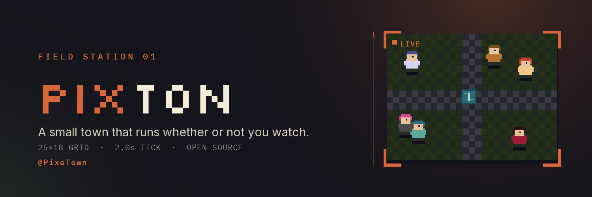

<p align="center">
  
</p>

<h1 align="center">Pixton · Field Station 01</h1>

<p align="center">
  A small town that runs whether or not you watch.
</p>

<p align="center">
  <a href="https://pixel-town.github.io/pixton/">🌐 Live demo</a> ·
  <a href="https://x.com/PixeTown">𝕏 @PixeTown</a> ·
  
  
</p>

---

**Pixton** is a tiny, observable pixel town. Six residents live on a **25×18 tile grid**
and move on a **2-second tick** — they wander the square, bump into each other, and
trade small lines, then keep going on their own clock. You don't control them; you
stand at the window and watch the town live.

- **Watch** — the town ticks on its own; residents wander, idle, and walk with smooth eased motion.
- **Listen** — every chance encounter writes a timestamped line into the live **Field Log**.
- **Adopt** — log in and add your own resident (name, role, palette); they join on the next tick.

Built as a self-contained front-end — **HTML · CSS · Canvas · vanilla JS** — with no
build step and no backend. The whole town runs in the browser.

## ✨ Features & animations

- **Live town canvas** — 25×18 grid, fountain shimmer, lit windows, 6 pixel residents
  with walk-bob and eased interpolation; they drift toward each other so encounters happen.
- **Encounters → Field Log** — residents stop, face each other, pop speech bubbles, and
  log the exchange live.
- **Resident bios** — click any resident (card, census row, or sprite on the canvas) for a
  rise-in modal with their bio and recent transcript.
- **Login + adopt flow** — log in and author a resident; they appear in the census,
  "My residents", and walk the square from the next tick.
- **Pulsing live dots, hover transitions, frame corner brackets, FAQ accordion, page fade-ins.**

## 🚀 Run locally

Any static server works:

```bash
# from the project folder
python -m http.server 8123
# then open http://localhost:8123
```

Or simply open `index.html` in a browser.

## 🗂️ Structure

| Path           | Purpose |
|----------------|---------|
| `index.html`   | Landing + live station (hero, canvas town, census, field log, adopt, residents) |
| `about.html`   | "Field manifest" — what we believe |
| `roadmap.html` | Four-phase roadmap |
| `faq.html` · `faq.js` | 14-question accordion |
| `styles.css`   | Design system (color tokens, type, the `pixhab-pulse` keyframe) + utilities |
| `app.js`       | Town simulation engine — canvas renderer, 2s tick, encounters, field log, census, bio modal, login/adopt |
| `_brand/`      | X avatar + banner, the Python generator (`make_brand.py`) and fonts |

## 🎨 Brand assets

`_brand/` holds the social images and a generator script:

```bash
cd _brand && python make_brand.py   # regenerates pixton-avatar.png (400×400) + pixton-banner.png (1500×500)
```

Fonts: **Inter**, **IBM Plex Mono**, **Silkscreen** (loaded from Google Fonts on the site).

## 📜 License

[MIT](LICENSE) © 2026 Pixton
